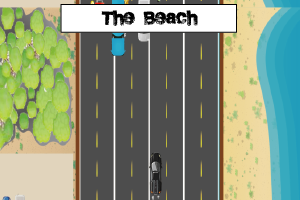
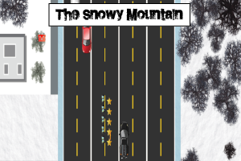
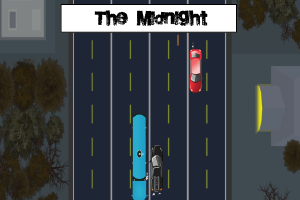
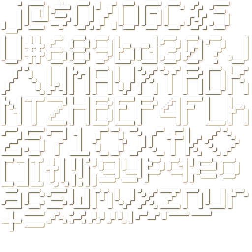
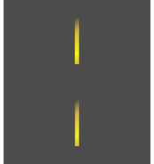
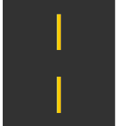
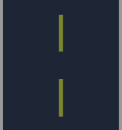

# CarCrasher

A quality experience game built in Phaser 2

Developed by: Anthony Jay P. Ansit

Date of submission: October 20, 2020

## Demo link

Video demo: https://drive.google.com/file/d/1J3qw9dPtBNry8y09P-C7MozD7san8mDp/view?usp=sharing

Game demo: http://carcrasher.infinityfreeapp.com/

## Game Development Documentation 

### Project Description

This game design document describes the details for a browser 2D survival game. This documentation aims to describe and explain the development of the game from asset development to its implementation in game.

### Characters

A total of ten (10) characters are present in this game. Six (6) are different types of **Cars**, while the remaining four (4) are **Consumables** in game.

The main character of this game is a car enthusiast and also a modern daredevil. He alernates between different cars always improving his experience. He accepts any challenge that are thrown at him even if it cost his life. A healthy reminder though, the main character is immortal and can revert back everytime he fails to beat his previous record.

#### Cars

* **Black Car** - 1 of 2 default cars in your inventory

* **Taxi** - 1 of 2 default cars in your inventory

* **Red Car** - Can be purchased in shop. This car model and four (4) others is also used as a civillian car.

* **Police Car** - Can be purchased in shop. This car model and four (4) others is also used as a civillian car.

* **Van** - Can be purchased in shop. This car model and four (4) others is also used as a civillian car.

* **Truck** - Can be purchased in shop. This car model and four (4) others is also used as a civillian car.

#### Consumables

* **Hourglass** - It increases your time by one (1) which increases your survivability. 

* **Healthbox** - It increases your health by one hundred percent (100%) which greatly increases your survivability.

* **Booster** - It increases your speed while safe from collision.

* **Star** - It serves as the currency in game to purchase new cars.

### Story

In a seemingly peaceful day, one guy who calls himself a "daredevil" goes on a quest of beating his previous records by improving his survival rate on different highways. In the same day, the daredevil encountered problems on his quest. He realized that he is in fact running on a one way lane, and his only chance of survival is to avoid the cars that are moving towards him.

### Theme

This game depicts an intense survival, car chase vibe. The use of color in this game is intensified and is approriately used in accordance to what setting the character is in. Every element of this game harmonizes in creating an atmosphere that is intense and appropriate for survival games. It has also replicated the nuances of real highway events and car properties. This game should not show gory designs but instead designs that are somewhat similar to reality but have game-like experience.

### Art Style

This is a 2D isometric game, with high quality 2D sprites. Everything should be very colorful and feel alive, with highly animated scenarios and layered backgrounds.

### Music and Sounds

The music should stimulate an intense, almost 'car chase' sort of vibe. Every feature in the game should be accompanied with clear and stimulating sound elements such as car crash sound effect, explosion, and losing.

### Setting

This game is set on three (3) different highways which have different color theme.

**The beach** - which depicts a sunday morning setting of a highway that has houses on the left corner and a beach on the right.

  
  
**The Snowy Mountain** - which depicts a cold winter noon of a highway that has houses on the left corner and a forest on the right.
  
  
  
**The Midnight** - which depicts a dark evening of a highway that has has post towers and forest on the left corner and houses on the right.

  

### Gameplay and Controls

  * Goals: Reach high survivability (higher than your previous records) and Buy all cars.
  * User Skills: evasion skills, resource control, fast reaction, and fast eye detection.
  * Items and power-ups: This game has a total of four (4) consumables items: 1. Booster - respawns every 15 seconds which allows you to avoid collision while your speed is increased. 2. Healthbox - respawns every 25 seconds which increases your health to one hundred percent (100%) if hitted. 3. Hourglass - respawns 5 instances every 6 seconds which increases your timer to allow you to survive longer. 4. Star - respawns every 5 seconds which serve as your money in game. 
  * Progression and Challenge: The game mechanics never changes, but the terrain does. There are three (3) maps which you could choose but has similar difficulties.
  * Losing: There are 2 lost cases in this game. First is when your HP goes to 0. Second is when you run out of time. The timer starts at 1 minute and decrements every second.

  **The users can either tap the keyboard keys A and D or the arrow keys Left and Right to move left and right. Tap the G keyboard key to activate booster if you found one.**
  
### Technical Description

  This game is very compatible with desktop set-ups and is recommended to be played there. This game is also playable in mobile devices but is not recommended.
  
### Demographics

Age: 12 to 50 , Sex: Everyone, Casual players mostly 

### Platform and Monetization

Free to play on open market websites such as Y8.com and itch.io.

### Fonts

 

### Audio

boosterSoundtrack at https://github.com/centino90/carcrasher/blob/master/assets/audio/booster-soundtrack.mp3

backgroundSoundtrack at https://github.com/centino90/carcrasher/blob/master/assets/audio/background-music.mp3

carExplosion at https://github.com/centino90/carcrasher/blob/master/assets/audio/car-explosion.mp3

carManuever at https://github.com/centino90/carcrasher/blob/master/assets/audio/car-manuever.mp3

lost at https://github.com/centino90/carcrasher/blob/master/assets/audio/lost-captured.mp3

nitro at https://github.com/centino90/carcrasher/blob/master/assets/audio/nitro.mp3

noNitro at https://github.com/centino90/carcrasher/blob/master/assets/audio/noNitro.mp3

pickupBoost at https://github.com/centino90/carcrasher/blob/master/assets/audio/pickup-boost.mp3

startEngine at https://github.com/centino90/carcrasher/blob/master/assets/audio/start-engine.mp3

successfulPurchase at https://github.com/centino90/carcrasher/blob/master/assets/audio/successfulPurchase.mp3

unsuccessfulPurchase at https://github.com/centino90/carcrasher/blob/master/assets/audio/successfulPurchase.mp3

wallCrash  at https://github.com/centino90/carcrasher/blob/master/assets/audio/wall-crash.mp3

### Graphics

#### Backgrounds
  - are what used in each game state to cover the default background and give additional aesthetic to the game. Aside from the game state backgrounds, the game also has in-game    backgrounds which are divided in four (4) parts: Left ground, Right ground, Middle ground, and Extension tile that are mold together to form a single scene.

  
  
  
  
  
  
  
  
* Left ground

  
  
  

* Right Ground

  
  
  

* Middle Ground

  
  
  
  
* Extension Tile

  
  
  
  
  
#### Others

* Buttons

  
  
  
  
  
  
  
  
  
* Health bar

  
  
* Booster status

  Booster Sprite frame 0
  
* Explosion

  
  
* Preload Bar

  

### Game States and Scenes
This is where the in-game snaps of each game states (scenes) will be presented. In this section, you will see and understand a few of my reasonings and choices behind the designs and aesthetics of this game.

//------------------------------ END OF FILE --------------------------------------------------------------------------------//

